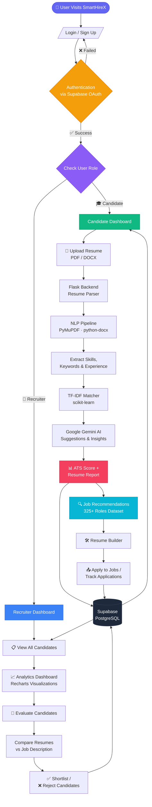

# SmartHireX 🚀

SmartHireX is an AI-powered, full-stack recruitment platform connecting candidates with the right opportunities while streamlining the hiring process for recruiters. Built with React (Vite) on the frontend and Flask on the backend, it leverages Natural Language Processing (NLP), Google Generative AI, and Supabase for a robust, scalable, and intelligent hiring experience.

## ✨ Key Features
- **AI-Powered Resume Analysis:** Extracts skills, analyzes keywords, and evaluates resumes against job descriptions using PyMuPDF and scikit-learn.
- **Skill-Based Job Recommendations:** Intelligent recommendation engine that maps extracted resume skills to a curated dataset of over 325 job roles, providing customized career suggestions.
- **Role-Based Workflows:** Distinct, secure routing and dashboards for both Candidates and Recruiters.
  - **Candidates:** Resume Builder, AI job matching, job search, and application tracking.
  - **Recruiters:** Analytics dashboard, candidate evaluation, and profile management.
- **Google OAuth & Secure Authentication:** Powered by Supabase Auth for seamless user onboarding and secure session management.
- **Modern UI/UX:** Built with React, Tailwind CSS, Radix UI, and Framer Motion for a highly responsive, interactive, and premium interface.

## 🛠️ Tech Stack

### Frontend
- **Framework:** React 18 (Vite)
- **Styling:** Tailwind CSS v4, Emotion
- **Components:** Radix UI primitives, Material UI (`@mui/material`)
- **Animations:** Framer Motion (`motion`), tw-animate-css
- **State/Routing:** React Router v7
- **Data Visualization:** Recharts
- **Authentication:** Supabase JS Client (`@supabase/supabase-js`)

### Backend
- **Framework:** Flask (Python)
- **AI & NLP:** `scikit-learn` (TF-IDF similarity matching), `google-generativeai` (AI suggestions and data extraction), `PyMuPDF` (PDF parsing), `python-docx` (DOCX parsing)
- **Database & Auth:** Supabase (PostgreSQL, Authentication)

## 📁 Project Structure
- `SmartHireX Website Frontend/` - The complete React frontend codebase.
- `backend/` - The Flask API, containing the NLP pipeline, matcher engine, and database interactions.
- `dataset/` - Predefined datasets used for AI job recommendations and analysis.
- `database_schema.sql` - Supabase PostgreSQL database schema.

## 🚀 Getting Started

### Prerequisites
- Node.js (v18+)
- Python (3.9+)
- A Supabase Project
- Google Gemini API Key

### Backend Setup
1. Navigate to the backend directory:
   ```bash
   cd backend
   ```
2. Create and activate a virtual environment:
   ```bash
   python -m venv venv
   # Windows
   venv\Scripts\activate
   # macOS/Linux
   source venv/bin/activate
   ```
3. Install dependencies:
   ```bash
   pip install -r requirements.txt
   ```
4. Configure your `.env` file in the `backend/` directory:
   ```env
   GEMINI_API_KEY=your_google_gemini_api_key
   # Add your Supabase credentials if required by the backend
   ```
5. Start the Flask server:
   ```bash
   flask run
   ```

### Frontend Setup
1. Navigate to the frontend directory:
   ```bash
   cd "SmartHireX Website Frontend"
   ```
2. Install dependencies:
   ```bash
   npm install
   # or if using pnpm:
   pnpm install
   ```
3. Configure your `.env` file in the frontend directory:
   ```env
   VITE_SUPABASE_URL=your_supabase_project_url
   VITE_SUPABASE_ANON_KEY=your_supabase_anon_key
   ```
4. Start the Vite development server:
   ```bash
   npm run dev
   # or
   pnpm run dev
   ```

## 🧠 Core System Architecture
- **NLP Pipeline:** The backend processes uploaded resumes, extracts text from PDFs/DOCXs, tokenizes content, and extracts relevant skills and keywords.
- **Matcher Engine:** Calculates mathematical similarity scores between user resumes and target job profiles, driving the recommendation and analysis results.
- **Supabase Integration:** User roles (Candidate vs. Recruiter) are stored securely in Supabase user metadata, governing routing and access control to specific platform sections.

---

## 🔄 Platform Workflow



---
*Built to make hiring smarter, faster, and more effective.*
